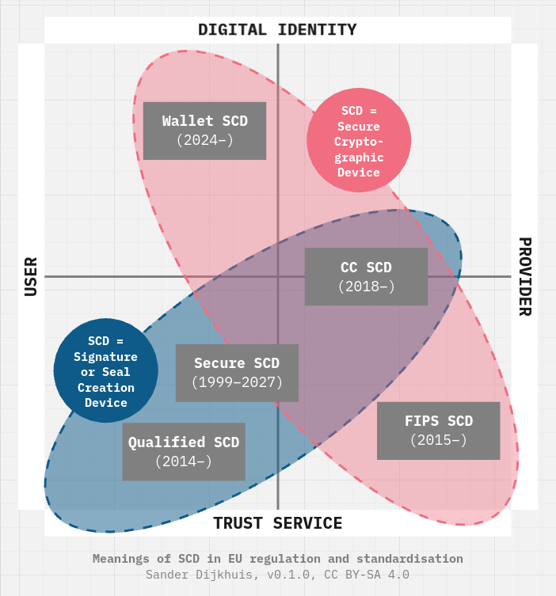

# Exploration of wallet secure cryptographic devices

This working document contains notes about technical insights on the wallet secure cryptographic device (WSCD). For context, see [Wallet Secure Cryptographic Commons](../README.md).

## Positioning of WSCD

From a [2024-11-30 LinkedIn post](https://www.linkedin.com/posts/sanderd_eidas-domaindrivendesign-activity-7268708874105376769-nZxL):

## Taxonomy of WSCD architectures

Combining the options from [ARF v1.4 § 4.3](https://eu-digital-identity-wallet.github.io/eudi-doc-architecture-and-reference-framework/1.4.0/arf/#43-architecture-types) and the examples from [HDKeys v01 § 5.1](https://datatracker.ietf.org/doc/html/draft-dijkhuis-cfrg-hdkeys-01#name-secure-cryptographic-device):

- Remote WSCD, for example:
	- cryptographic module (hardware security module, HSM) certified against EN 419221-5:2018, running for example a local client application providing a WSCA service.
- Local External WSCD, for example:
	- standalone device, for example:
		- GlobalPlatform secure element, running for example a Java Card applet providing a WSCA service for:
			- Personal Identity Verification (PIV);
			- Fast IDentity Online 2 (FIDO2).
- Local WSCD, for example:
	- standalone programmable cryptographic chip, for example:
		- smartphone embedded universal integrated circuit card (eUICC), running for example a Subscriber Identity Module (SIM) providing a WSCA service, also called eSIM;
		- smartphone embedded secure element (eSE), running for example a Java Card applet providing a WSCA service.
	- preprogrammed security platform, for example:
		- Android trusted execution environment used as a WSCA service;
		- Android StrongBox secure element used as a WSCA service;
		- iOS Secure Enclave system-on-chip used as a WSCA service;
		- Trusted Platform Module (TPM) used as a WSCA service.
- Hybrid.

When critical assets such as the PID-bound private key are fully managed by a Remote WSCD, the architecture is still considered to be a Remote WSCD architecture, even if other devices are used for authentication. For example:

- combination of PIV card as possession factor and PIN verification in an HSM (an approach proposed by Sweden);
- combination of Android/iOS security platform or standalone device, with verification in an HSM (an approach proposed in [SCAL3](https://github.com/cleverbase/scal3)).

## Related resources

- [Cryptographic Service Provider 2 (CSP2)](https://www.bsi.bund.de/EN/Themen/Unternehmen-und-Organisationen/Standards-und-Zertifizierung/Technische-Richtlinien/TR-nach-Thema-sortiert/tr03181/TR-03181_node.html), BSI TR-03181 Version 0.94
